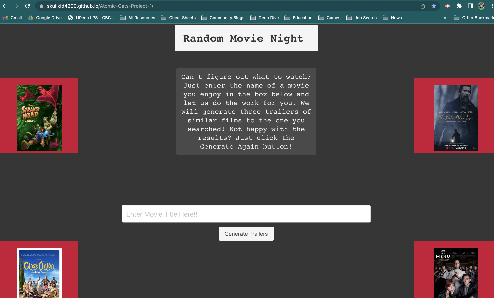
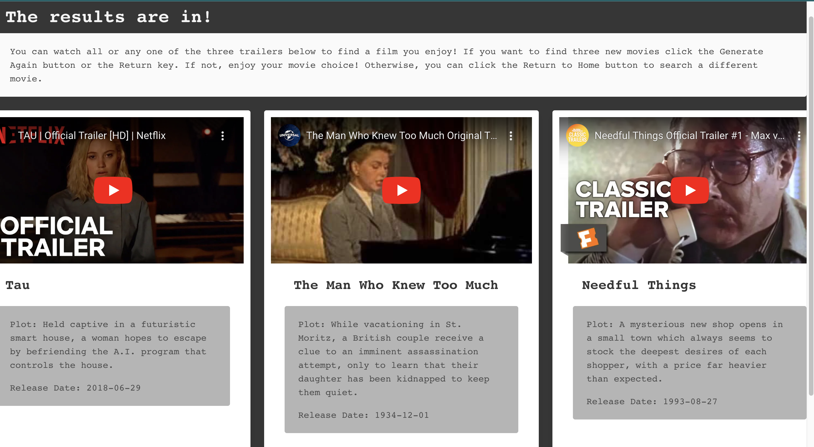

# Random Movie Night

## Description

It's friday night, the gang's all here, but you can't decide what to watch. The agony! With this new application, you can take movie night to the next level and skip all the bickering and the scrolling. This application allows you to enter the title of a movie and randomly generate three similar movies. The results will provide you with more than just three options, it will also provide a plot description and the trailers right at your fingertips. Don't like what you see? The Generate Again button makes it easy to flip through your options until you find the one that's just right.

## Installation

No installation required! Just follow the provided link to the website.

## Credits

Equal Contributors:

Priyanka Agrawal GitHub: https://github.com/priyanka-agrawal025

Jack Einhorn GitHub: https://github.com/skullkid4200

Steph O'Connell GitHub: https://github.com/OConnell-Coder

## License

MIT License

## Features

Easy to use input box for movie search.
Helpful navigation buttons to run the search again, or to return to the homepage to search a different movie.

## Usage

Website Link: https://skullkid4200.github.io/Atomic-Cats-Project-1/

GitHub Repo Link: https://github.com/skullkid4200/Atomic-Cats-Project-1

